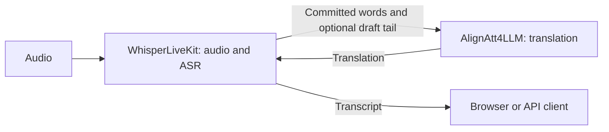

<p align="center">
  
</p>
<p align="center"><b>Self-hosted transcription and simultaneous translation</b></p>

<p align="center">
  <a href="https://pypi.org/project/whisperlivekit/"></a>
  
  <a href="LICENSE"></a>
  <a href="https://arxiv.org/abs/2606.03967"></a>
</p>

WhisperLiveKit transcribes audio as it arrives, with optional speaker diarization and translation. It includes a browser interface, a command-line client, a Python API, and a server with native WebSocket, OpenAI-compatible REST, and Deepgram-compatible WebSocket endpoints.

Whisper models use SimulStreaming or LocalAgreement to decide when words are stable enough to emit. Other backends supply their own streaming processors. Models are shared within a server process; each connection has its own audio buffers and transcript state.

<p align="center">
  
</p>

## Get started

Use Python 3.11–3.13 and install FFmpeg for compressed audio input:

```bash
pip install whisperlivekit
wlk --model base --language en
```

Open [localhost:8000](http://localhost:8000) and allow microphone access. The first launch downloads the model. Add `--pcm-input` to use uncompressed microphone audio without FFmpeg; REST file transcription still requires FFmpeg.

On Apple Silicon, install the MLX Whisper extra:

```bash
pip install "whisperlivekit[mlx-whisper]"
```

For Docker, GPU dependencies, and remote access, see [deployment](docs/deployment.md). For development installs, see [CONTRIBUTING.md](CONTRIBUTING.md).

## Command line

```bash
wlk run whisper:tiny                         # Download a model and start the server
wlk transcribe meeting.wav                  # Transcribe a file locally
wlk transcribe podcast.mp3 --format srt -o podcast.srt
wlk listen                                  # Microphone input; requires the listen extra
wlk models                                  # Show backends and cached models
wlk pull large-v3                            # Download model weights
wlk check                                   # Check local dependencies
```

Run `wlk --help` for commands and `wlk serve --help` for server options. The default model is `base`, the default language is `auto`, and diarization and translation are off until requested.

## Backends

| Family | WLK backends | Installation extras |
|---|---|---|
| Whisper | `auto`, `whisper`, `faster-whisper`, `mlx-whisper` | Base installation; `mlx-whisper` for Apple Silicon |
| Qwen3-ASR | `qwen3-streaming`, `qwen3-vllm`, `qwen3-vllm-metal` | Extra with the corresponding backend name |
| Voxtral | `voxtral`, `voxtral-mlx` | `voxtral-hf` or `voxtral-mlx` |
| SenseVoiceSmall | `funasr` | `funasr` |
| Canary | `canary` | `canary` |
| Speaker diarization | `sortformer`, `diart` | `diarization-sortformer` or `diarization-diart` |

Install an extra with `pip install "whisperlivekit[extra-name]"`. Several GPU stacks require separate environments; see [backend setup and constraints](docs/backends.md) and the conflicts declared in [pyproject.toml](pyproject.toml). Diart is limited to Python 3.11–3.12.

## Simultaneous translation with AlignAtt4LLM

[AlignAtt4LLM](https://github.com/QuentinFuxa/Alignatt4LLM) is the companion research project by Quentin Fuxa and Dominik Macháček, described in the [IWSLT 2026 paper](https://arxiv.org/abs/2606.03967). It adapts the AlignAtt translation policy to decoder-only LLMs: selected attention heads determine which part of a translation can be emitted from the source words received so far.

WhisperLiveKit supplies the live transcript. An `alignatt-mt-server` process handles translation and can run on a separate CUDA machine. WLK can also send the unstable transcript tail so the translator can draft ahead while waiting for source words to be committed.



After [setting up the translation server](docs/translation-alignatt.md):

```bash
# In the AlignAtt4LLM inference environment
alignatt-mt-server --preset gemma_low_latency --port 8765

# In the WhisperLiveKit environment
wlk --model base --language en --target-language de \
    --translation-backend alignatt --alignatt-url ws://localhost:8765
```

The [integration guide](docs/translation-alignatt.md) covers language directions, latency controls, and current limitations. The paper evaluates its own ASR–MT cascade; its quality and latency results are not measurements of every WLK backend combination.

For in-process NLLB translation, install `whisperlivekit[translation]` and use `--target-language de` without `--translation-backend alignatt`.

## APIs and clients

```bash
# OpenAI-compatible file transcription
curl http://localhost:8000/v1/audio/transcriptions -F file=@audio.wav
```

| Interface | Endpoint or entry point |
|---|---|
| Native streaming WebSocket | `/asr` |
| Deepgram-compatible WebSocket | `/v1/listen` |
| OpenAI-compatible REST | `/v1/audio/transcriptions` |
| Python pipeline | `TranscriptionEngine` and `AudioProcessor` |
| Browser tab capture | [Chrome extension](chrome-extension/README.md) |
| Native desktop client | [macOS app](macos/WhisperLiveKitMac/README.md) |

API compatibility covers the subsets listed in [the API reference](docs/API.md). Native sessions can override `language`, `target_language`, and supported decoder `context` through query parameters. See [technical integration](docs/technical_integration.md) for a complete Python lifecycle example.

## Benchmarks and testing

Use `wlk bench --json results.json` to evaluate the configured backend on your hardware. Read [the benchmark notes](benchmarks/README.md) before interpreting the results: inference time, streaming delay, and translation latency measure different things.

Historical H100 and M5 results are kept in [benchmarks/archive](benchmarks/archive/README.md). They are not presented as a current backend ranking. The July scatter plots lack the per-sample records needed to recompute their WER and establish a reproducible comparison.

See [CONTRIBUTING.md](CONTRIBUTING.md) for the regression suite and real-audio streaming checks. Tests should protect observable behavior: transcript continuity, timestamps, speaker boundaries, API semantics, and session isolation.

## Documentation

- [Server configuration](docs/configuration.md)
- [Models and custom checkpoints](docs/default_and_custom_models.md)
- [Backend setup](docs/backends.md)
- [Deployment and Docker](docs/deployment.md)
- [Troubleshooting](docs/troubleshooting.md)
- [API reference](docs/API.md) and [Python integration](docs/technical_integration.md)

## Research and citation

WLK builds on [SimulWhisper](https://arxiv.org/abs/2406.10052), [SimulStreaming](https://arxiv.org/abs/2506.17077), [WhisperStreaming](https://github.com/ufal/whisper_streaming), [Streaming Sortformer](https://arxiv.org/abs/2507.18446), [Qwen3-ASR-causal](https://github.com/QuentinFuxa/Qwen3-ASR-causal), and [NLLW](https://github.com/QuentinFuxa/NoLanguageLeftWaiting).

If you use the AlignAtt4LLM translation backend in research, cite its paper:

```bibtex
@article{fuxa2026alignatt4llm,
  title = {AlignAtt4LLM: Fast AlignAtt for Decoder-Only LLMs at IWSLT 2026 Simultaneous Speech Translation Task},
  author = {Fuxa, Quentin and Macháček, Dominik},
  year = {2026},
  doi = {10.48550/arXiv.2606.03967},
  url = {https://arxiv.org/abs/2606.03967}
}
```

WhisperLiveKit is licensed under [Apache 2.0](LICENSE). Model weights and optional projects have their own licenses.
